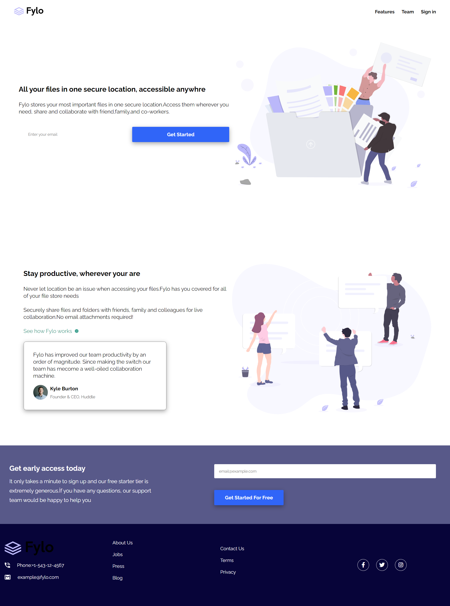
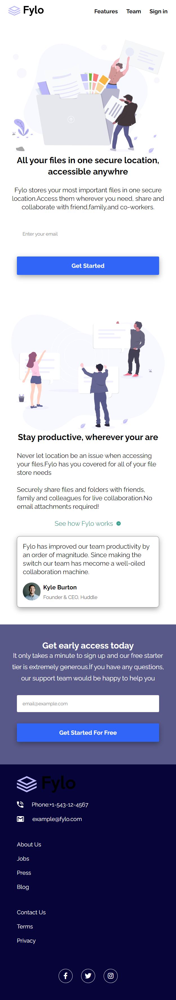

#  Frontend Mentor - Order Summary Card Solution

This is a solution to the [Fylo landing page with two column layout challenge on Frontend Mentor](https://www.frontendmentor.io/challenges/fylo-landing-page-with-two-column-layout-5ca5ef041e82137ec91a50f5). Frontend Mentor challenges help you improve your coding skills by building realistic projects.

## Table of contents

- [Overview](#overview)
  - [The challenge](#the-challenge)
  - [Screenshot](#screenshot)
  - [Links](#links)
- [My process](#my-process)
  - [Built with](#built-with)
- [Author](#author)

## Overview

### Screenshot

### Links

- [Solution URL](https://github.com/emre-02/Fylo-page)
- [Live Site URL]()

## My process

### Built with

- Semantic HTML5 markup
- CSS custom properties
- BEM
- Pure CSS
- Display Flex

## Author

- Frontend Mentor - [@Voldemort-07](https://www.frontendmentor.io/profile/Voldemort-07)
- Linkedin - (https://www.linkedin.com/in/yunus-emre-%C3%B6zt%C3%BCrk-83a794250/)
